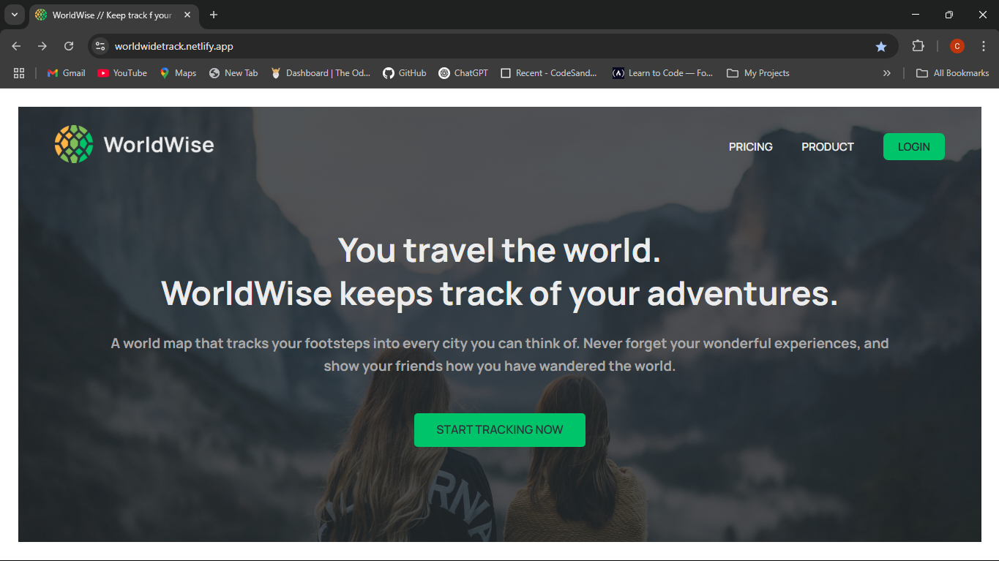
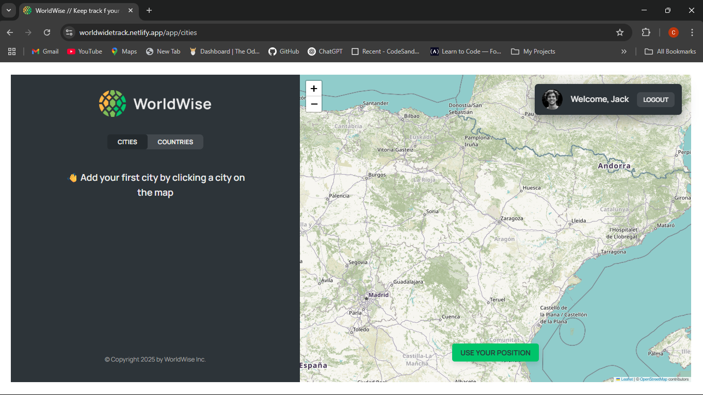
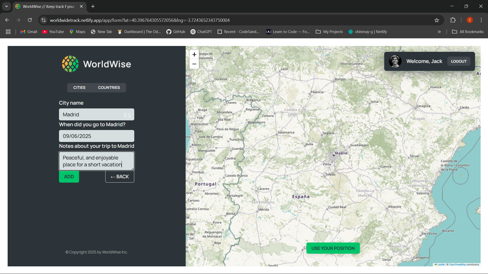

# 🗺️ WorldWise

A location-based travel tracker app that helps you **remember the places you've visited** and **plan where you want to go** — all visualized beautifully on a map!

> 🧭 Live Demo: [worldwidetrack.netlify.app](https://worldwidetrack.netlify.app/)

---

## 📚 About This Project

This project was built as part of the [React Course by Jonas Schmedtmann](https://codingheroes.io/), aimed at mastering advanced concepts in modern React development, including component design, state management with Context API, routing, and third-party integrations like Leaflet.

---

## ✨ Features

- 🌐 Interactive world map using Leaflet
- 📍 Add cities by clicking on the map
  - Auto-filled city and country (via reverse geocoding)
  - Date of visit and notes field
- 📂 Sidebar showing list of visited cities
- 🗑️ Delete cities from your travel list
- 💾 Data persistence via REST API

---

## 🛠️ Tech Stack

- **Frontend**:

  - React (Hooks, Context API)
  - React Router
  - React Leaflet (Map)
  - CSS Modules

- **Backend**:
  - JSON Server (hosted on [Render](https://render.com))

---

## 🖼️ Screenshots

 

---
