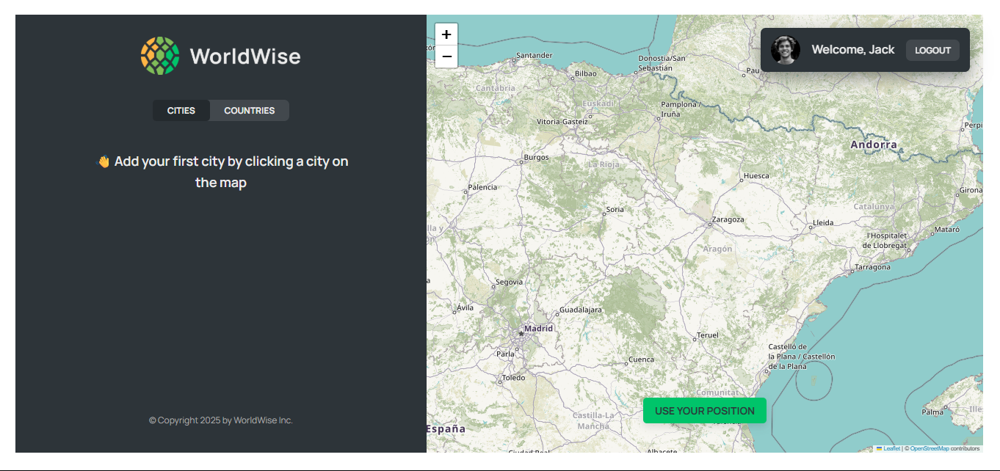
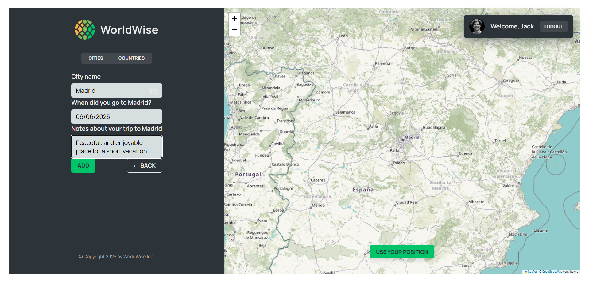
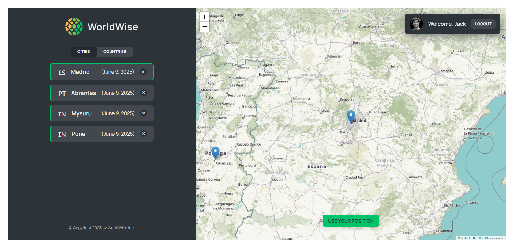
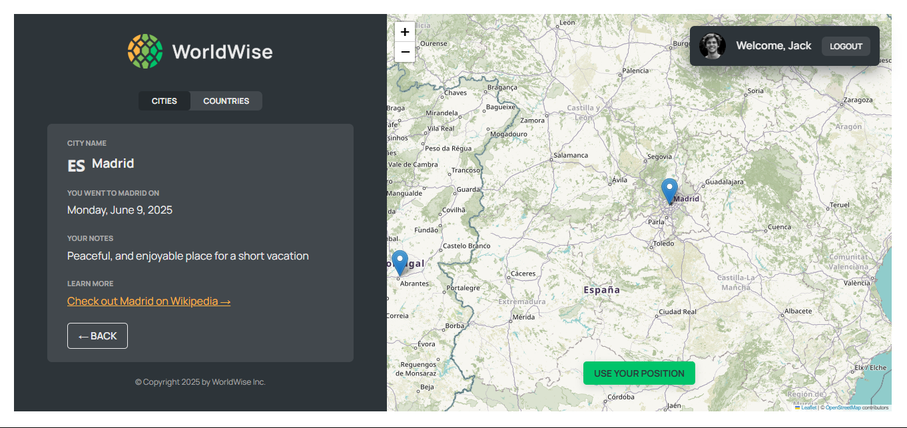

# 🗺️ WorldWise

A location-based travel tracker app that helps you **remember the places you've visited** and **plan where you want to go** — all visualized beautifully on a map!

> 🖥️ Live Demo: [worldwidetrack.netlify.app](https://worldwidetrack.netlify.app/)

---

## 📚 About This Project

This project was built as part of the [React Course by Jonas Schmedtmann](https://codingheroes.io/), aimed at mastering advanced concepts in modern React development, including component design, state management with Context API, routing, and third-party integrations like Leaflet.

---

## ✨ Features

- 🌐 Interactive world map using Leaflet
- 📍 Add cities by clicking on the map
  - Auto-filled city and country (via reverse geocoding)
  - Date of visit and notes field
- 📂 Sidebar showing list of visited cities
- 🗑️ Delete cities from your travel list
- 💾 Data persistence via REST API

---

## 🛠️ Tech Stack

- **Frontend**:

  - React (Hooks, Context API)
  - React Router
  - React Leaflet (Map)
  - CSS Modules

- **Backend**:
  - JSON Server (hosted on [Render](https://render.com))

---

## 🖼️ Screenshots

---

## 🔗 API

**Base URL:**  
`https://worldwise-api-qpfk.onrender.com`

**Endpoints:**

- `GET /cities` – Retrieve all cities
- `POST /cities` – Add a new city
- `DELETE /cities/:id` – Delete a city by ID

---

## 📄 License

This project is open source and available under the [MIT License](https://opensource.org/licenses/MIT).

---

## 🙌 Acknowledgements

- Project inspired by and built during [Jonas Schmedtmann's React Course](https://www.udemy.com/course/react-the-complete-guide-incl-redux/)
- [React Leaflet](https://react-leaflet.js.org/)
- [Nominatim API](https://nominatim.openstreetmap.org/) by OpenStreetMap
- [Netlify](https://www.netlify.com/) for frontend deployment
- [Render](https://render.com/) for backend hosting
